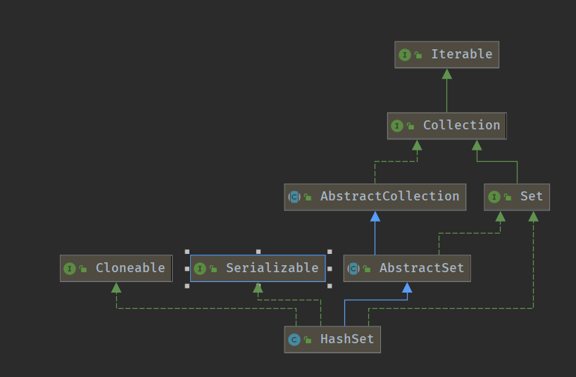
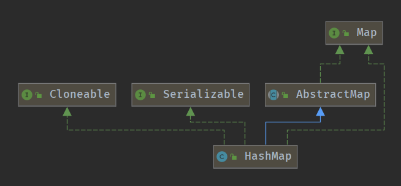
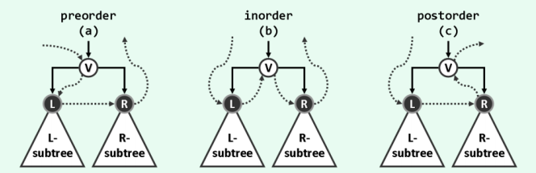
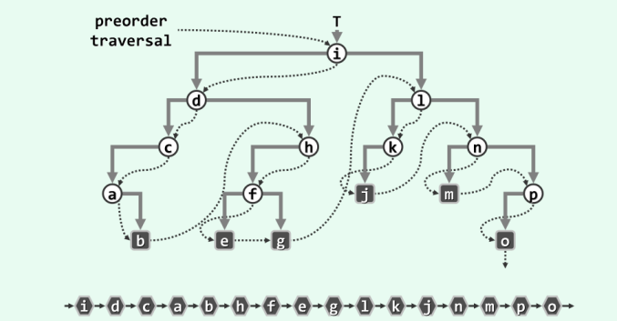
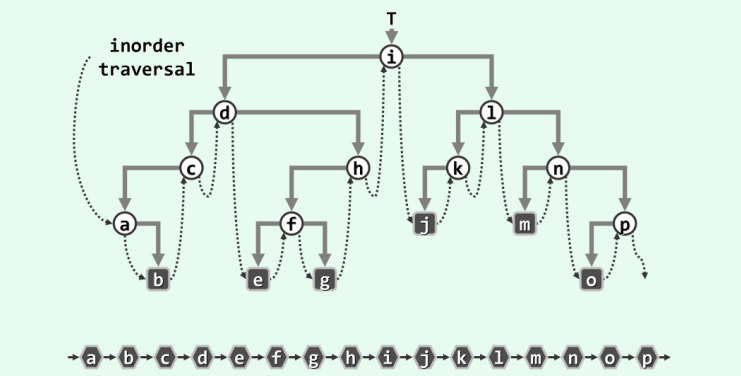
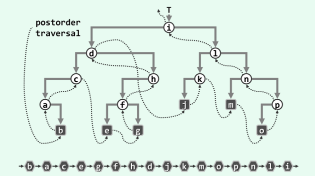
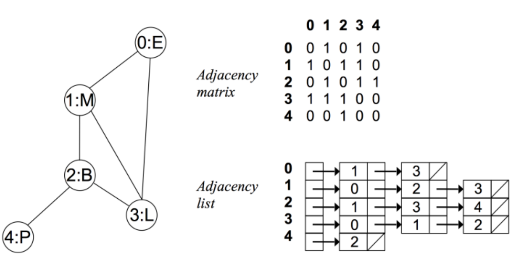

# 学习笔记

### 哈希表

#### 定义

通过散列函数` Hash Function`将关键码值映射到表中的某个位置进行查询。 但是经过散列函数处理后，不同的入参可能会映射到同一个码值，即多个不同的入参需要存在同样的位置，这种现象称为**哈希碰撞**，解决该问题的一种方案是**
拉链式解决法**，即通过链表的方式将数据进行映射存储。当然最好的解决办法还是选取更合理更有效的散列函数才是根本。

#### 复杂度

时间\空间复杂度 O(1)

#### 常见哈希表

<li>
Map: key-value对，key不重复
<ul> 
- new HashMap()/new TreeMap()
</ul>
<ul>
- map.set(key,value)
</ul>
<ul>
- map.get(key)
</ul>
<ul>- map.has(key)
</ul> <ul>- map.size()</ul> <ul>map.clear()</ul>
</li> 
<li>Set: 不重复元素的集合
<ul>- new HashSet()/new TreeSet()</ul>
<ul>- set.add(value)</ul>
<ul>- set.delete(value)</ul>
<ul>- set.hash(value)</ul>
</li>
<li>
HashSet实现图



HashSet 是由 HashMap实现的，利用了HashMap key不能重复的原理，对于map中的value默认不赋值即可,常规的增删改查时间复杂度为O(1)
</li>
<li> HashMap 实现图



HashMap 是非线程安全的实现类，常规的增删改查复杂度为O(1)；

HashMap 是用链表实现的，具体的链表操作没太读懂，后续重新读；

get操作：返回值为null时可能是key不存在，或key映射的value为null，因此如需区分需调用containsKey进行判断；

put操作：get的反向操作；

Hash函数为 ``(h = key.hashCode()) ^ (h >>> 16)``

```
补充知识
1.^(亦或运算) ，针对二进制，相同的为0，不同的为1
2.&（与运算） 针对二进制，只要有一个为0，就为0
3.<<(向左位移) 针对二进制，转换成二进制后向左移动x位，后面用0补齐
4.>>(向右位移) 针对二进制，转换成二进制后向右移动x位
5.>>>(无符号右移)  无符号右移，忽略符号位，空位都以0补齐
```

TODO：后续此部分待完善

</li>

### 树 Tree

`LinkedList` 是特殊化的 `Tree`;`Tree` 是特殊化的`Graph`

#### 二叉树定义

``` java
// 二叉树的定义
public class TreeNode{
    public Object val;
    public TreeNode left,right;
    public TreeNode(Object val,TreeNode left, TreeNode right){
    this.val = val;
    this.left = left;
    this.right = right;
    }
}
```

#### 二叉树遍历 Pre-order/In-order/Post-order

按惯例左兄弟优先于右兄弟，故若将节点及其孩子分别记作V、L和R，则下图所示，局部访问的次序可有VLR、LVR和LRV三种选择。根据节点V在其中的访问次序，三种策略也相应地分别称作先序遍历、中序遍历和后序遍历



**大前提，二叉树传进来的是头节点引用**

1. 前序(Pre-order): 根-左-右 V-L-R

   

   ``` java
   /**
   * 前序递归调用二叉树存入list
   */
   public void preOrder(TreeNode node){
       list.add(node);
       if(node.left != null){
           preOrder(node.left); 
       }
       if(node.right != null){
           preOrder(node.right); 
       }
   }
   ```
   **Note:**

   理解调用除了看图中的调用顺序外，应当把**归**也重点考虑上，在脑海中看着图去思考为啥`g`的节点是`l`,因为程序g的上个节点是`f`,`f`遍历完了右节点，往上归，`h`无右节点，往上归，`d`遍历完了右节点，往上归，`i`
   遍历完了左节点，故需遍历其右节点，即`l`
2. 中序(In-order): 左-根-右 L-V-R

   
   ``` java
   /**
   * 中序递归调用二叉树存入list
   */
   public void inOrder(TreeNode node){
       if(node.left != null){
           inOrder(node.left); 
       }
       list.add(node); 
       if(node.right != null){
           inOrder(node.right); 
       }
   }
   ```
   ```
   调用关系: 结点无左子结点或左子结点遍历完时存储该结点
   第1次递归结束调用关系: i-d-c-a;因此存储暂为a
   第2次递归结束调用关系: a-b;因此存储暂为a-b
   第3次递归结束调用关系: c,存储为a-b-c
   第4次递归结束调用关系: d,存储为a-b-c-d
   第5次递归结束调用关系: d-h-f-e,存储为a-b-c-d-e
   第6次递归结束调用关系: f,存储为a-b-c-d-e-f
   第7次递归结束调用关系: f-g,存储为a-b-c-d-e-f-g
   第8次递归结束调用关系: h,存储为a-b-c-d-e-f-g-h
   第9次递归结束调用关系: i,存储为a-b-c-d-e-f-g-h-i
   第10次递归结束调用关系: i-l-k-j,存储为a-b-c-d-e-f-g-h-i-j
   第11次递归结束调用关系: k,存储为a-b-c-d-e-f-g-h-i-j-k
   第12次递归结束调用关系: l,存储为a-b-c-d-e-f-g-h-i-j-k-l
   第13次递归结束调用关系: l-n-m,存储为a-b-c-d-e-f-g-h-i-j-k-l-m
   第14次递归结束调用关系: n,存储为a-b-c-d-e-f-g-h-i-j-k-l-m-n
   第15次递归结束调用关系: n-p-o,存储为a-b-c-d-e-f-g-h-i-j-k-l-m-n-o
   第16次递归结束调用关系: p,存储为a-b-c-d-e-f-g-h-i-j-k-l-m-n-o-p
   ```
3. 后序(Post-order): 左-右-根 L-R-V

   

   ``` java
   /**
   * 后序递归调用二叉树存入list
   * list预先定义
   */
   public void postOrder(TreeNode node){
       if(node.left != null){
           postOrder(node.left); 
       }
       if(node.right != null){
           postOrder(node.right); 
       }
       list.add(node); 
   }
   ```

#### 二叉搜索树 `Binary Search Tree`

二叉搜索树也称二叉排序树、有序二叉树、排序二叉树，是一棵空树或具有如下性质的二叉树：

1. 左子树上***所有结点***的值均小于它的根节点的值；
2. 右子树上***所有结点***的值均大于它的根节点的值；
3. 以此类推，左、右子树也分别为二叉查找树

中序遍历：升序排列

<a href="https://visualgo.net/zh/bst"> 二叉搜索树常见操作Demo </a>

### 堆 Heap 二叉堆 Binary Heap

#### 定义

可以迅速找到一堆数中的**最大**或者**最小值**的数据结构。

将根节点最大的堆叫做大顶堆或大根堆，根节点最小的堆叫做小顶堆或小根堆。

常见的堆有**二叉堆**、**斐波那契堆**

#### 二叉堆性质

通过**完全二叉树**来实现(**Note:** 不是二叉搜索树)；

> 完全二叉树: 一棵深度为k的有n个结点的二叉树，对树中的结点按从上至下、从左到右的顺序进行编号，如果编号为i（1≤i≤n）的结点与满二叉树中编号为i的结点在二叉树中的位置相同，则这棵二叉树称为完全二叉树。
>
> 满二叉树：一个二叉树，如果每一个层的结点数都达到最大值，则这个二叉树就是满二叉树。也就是说，如果一个二叉树的层数为K，且结点总数是(2^k) -1 ，则它就是满二叉树。

##### 大顶堆性质

1. 性质一: 是一棵完全树;

2. 性质二: 树中任意结点的值总是>=其子结点的值。

##### 二叉堆的实现

二叉堆一般通过**数组**来实现。 插入操作时将元素首先插入到尾部，然后往上递归找，一直找到满足二叉堆条件； 删除操作时将元素尾移到首结点，往下递归找，一直找到满足二叉堆条件。

0. 根节点(顶堆元素)是 a[0];
1. 索引为i的左孩子的索引是(2*i+1);
2. 索引为i的右孩子的索引是(2*i+2);
3. 索引为i的父节点的索引是floor((i-1)/2);1

> <a href="https://shimo.im/docs/Lw86vJzOGOMpWZz2/read"><strong>二叉堆实现Demo</strong></a>

### 图

有点有边即为图 `Graph(V,E)`

V - vertex: 点

1. 度 - 入度和出度 ---点连接了多少边
2. 点与点之间: 连通与否

E - edge:边

1. 有向和无向
2. 权重(边长)

#### 图的表示和分类

**邻接矩阵 邻接表**

常见高级算法(后续回头学)

1. DFS算法
2. BFS算法
3. <a href="https://leetcode-cn.com/problems/number-of-islands/">连通图个数</a>
4. <a href="https://zhuanlan.zhihu.com/p/34871092">拓扑排序</a>
5. <a href="https://www.bilibili.com/video/av25829980?from=search&seid=13391343514095937158">最短路径-Dijkstra</a>
6. <a href="https://www.bilibili.com/video/av84820276?from=search&seid=17476598104352152051">最小生成树</a>


