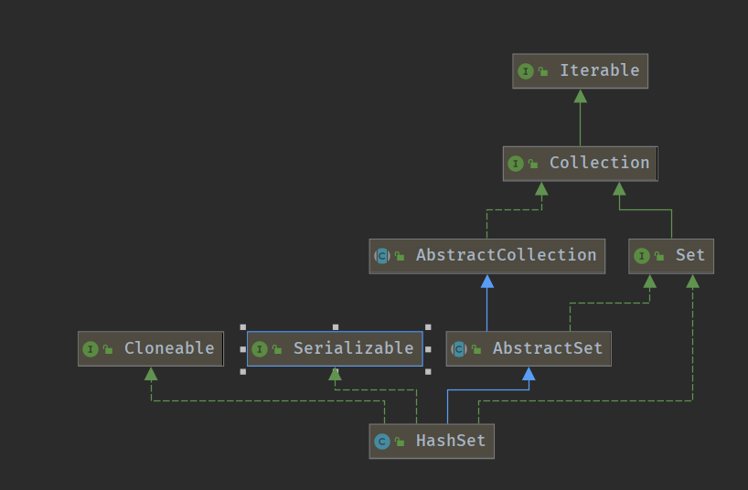

# 学习笔记

### 哈希表

#### 定义

通过散列函数` Hash Function`将关键码值映射到表中的某个位置进行查询。 但是经过散列函数处理后，不同的入参可能会映射到同一个码值，即多个不同的入参需要存在同样的位置，这种现象称为**哈希碰撞**，解决该问题的一种方案是**
拉链式解决法**，即通过链表的方式将数据进行映射存储。当然最好的解决办法还是选取更合理更有效的散列函数才是根本。

#### 复杂度

时间\空间复杂度 O(1)

#### 常见哈希表

<li>
Map: key-value对，key不重复
<ul> 
- new HashMap()/new TreeMap()
</ul>
<ul>
- map.set(key,value)
</ul>
<ul>
- map.get(key)
</ul>
<ul>- map.has(key)
</ul> <ul>- map.size()</ul> <ul>map.clear()</ul>
</li> 
<li>Set: 不重复元素的集合
<ul>- new HashSet()/new TreeSet()</ul>
<ul>- set.add(value)</ul>
<ul>- set.delete(value)</ul>
<ul>- set.hash(value)</ul>
</li>
<li>
HashSet 实现图

</li>

